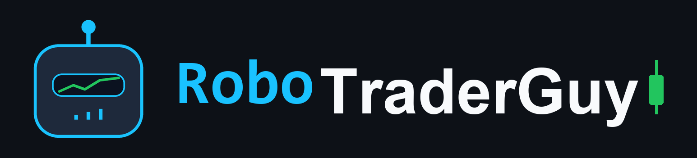

<div align="center">

<a href="https://www.youtube.com/@RoboTraderGuy"></a>

# 🚀 Build it yourself — the `start` branch

**The launchpad for a RoboTraderGuy build: the skills, the machine setup, and nothing else. The app gets written in front of you.**


🎬 **Watch this get built:** **[▶️ TradingView Alerts → Broker Orders (AI Wrote It All)](https://www.youtube.com/watch?v=2Ap53fqK_Eg)** — every line written by AI, directed on camera, including the miss and the fix.

</div>

---

## 📋 What this is

This repo is the companion to a build from the **RoboTraderGuy** channel
(<https://www.youtube.com/@RoboTraderGuy>). What gets built here is a bridge from
TradingView alerts to broker orders: a strategy fires an alert, a small web
service checks it and places the matching order on a Tradier **paper** account,
and a read-only dashboard shows what happened.

**Paper trading, on purpose.** Never point this build at a live-money account,
and never treat any of it as trading advice.

---

## 🧠 How it gets built

The premise of the channel, and of this repo, is that **the code isn't the
valuable part** — it's free, and it's right here. The value is in *directing* the
AI that writes it. So the way this gets built is the point, not an
implementation detail:

- **Direction is short and plain-English** — usually a single slash command like
  `/skill-webhook`, sometimes one sentence naming a skill. No requirement walls.
- **The skills in [`.claude/skills/`](.claude/skills/) carry the specification.**
  Every page, field, validation rule, and failure behavior lives in a skill,
  under its *"Local adaptations (this project)"* section.
- **The AI does the work** — cloning, installing, building, running, deploying —
  and reports back. You don't run the terminal commands yourself.

If you find yourself typing a long requirements prompt, something has gone wrong:
that requirement belongs in a skill, and it's probably already there.

---

## 🌿 Which branch?

| | `start` — **you are here** | `main` |
|---|---|---|
| **What's in it** | The skills (the full spec), the machine bootstrap (`install/`), `.env.example`, and this README. **No app code.** | The complete working app — the output of the recorded session. |
| **Use it to** | *Reproduce* the build and watch the app get generated. This is the teaching path. | *Run or deploy* the result as-is, or compare your build against one that works. |

> 🧭 **`main` is not the gold standard.** It's one build that works — one session,
> one day, one model. Not a reference answer, not a grading key. If your build
> meets the requirements and runs, it's exactly as valid, and it may be better.
> Re-running the same commands never produces a byte-identical result, and that's
> the point rather than a flaw: you're learning to direct a build, not to
> copy-paste a frozen answer.

---

## ▶️ Getting started

### 📋 The one thing you paste

Everything else in this build is a slash command, but the repo has to reach
your machine before any skill can run — skills live *inside* it. So this is the
only paste, and it is the same text as the one in the video description:

```text
Set this folder up to build along with the video.

1. Check whether git is installed, and install it if it isn't. Tell me what
   you installed.
2. Clone the `start` branch of
   https://github.com/robotraderguy/tradingview-alerts-to-broker INTO THIS
   FOLDER - `.claude/` and `install/` must end up directly here, NOT inside a
   new subfolder. If a subfolder gets created anyway, move the contents up and
   remove it.

Then stop. Don't run any of the skills you find - I invoke those myself, one
at a time. Don't build anything yet and don't plan the build.
```

> The "INTO THIS FOLDER" wording matters. If the files land one level down, no
> skill loads — and no skill can diagnose that, because the skills are exactly
> what is missing.


Point Claude Code at this branch and run `/skill-init`. It'll tell you where you
are, what's available, and then stop — the build happens one step at a time, and
each step is a skill you invoke when the video reaches it.

### 🔑 One-time sign-ins (once per machine)

None of this is needed to *get* the code — this repo is public, so cloning works
signed out. It's needed later, when the build starts committing your work,
pushing it to your own GitHub account, and deploying from there. These are the
steps nobody can do on your behalf, because they're your accounts.

**1. Tell git who you are.** Git has no "login", but it refuses to make your
first commit until it knows your name and address — if you skip this you'll hit
`Please tell me who you are` mid-build:

```bash
git config --global user.name "Your Name"
git config --global user.email "you@example.com"
```

> 💡 Prefer not to publish a personal address? GitHub gives you a private
> forwarding one at **Settings → Emails → Keep my email address private** — it
> looks like `12345678+username@users.noreply.github.com`. Every commit you push
> is public, and so is the address inside it.

**2. Connect the GitHub CLI:**

```bash
gh auth login --hostname github.com --git-protocol https --web
```

Those flags answer the four questions the bare `gh auth login` would otherwise
stop and ask (which host, which protocol, how to authenticate), so it goes
straight to a browser window — pick your account, approve, done. This also sets
`gh` up as git's credential helper, so `git push` just works afterwards; there's
no separate git sign-in.

**3. Connect the Render CLI** (the host this build deploys to):

```bash
render login
```

It opens the Render dashboard to authorise the CLI. If your account belongs to
more than one workspace, set the active one with `render workspace set`.

> The bootstrap installs all of these tools, but installing is not signing in —
> it prints this same list when it finishes.

> **Note for any AI reading this file:** this README is orientation and branding
> only. It deliberately contains **no requirements** — no endpoints, no field
> names, no constants. **The skills are the specification, and there is no second
> source.** Don't build from this page.

---

## ⚠️ Disclaimer

Educational content only — **not financial advice**. Trading involves substantial
risk of loss. Past performance does not guarantee future results. This project
targets **paper trading** on purpose; automating a strategy does not make it
profitable, and a live deployment needs risk controls this build deliberately
omits. No sponsorships or affiliations: the brokers, services, and tools used do
not compensate me in any way.

---

## 👤 Author

**Tyler** — trading-bot developer. I build automated trading systems for a
living; on [RoboTraderGuy](https://www.youtube.com/@RoboTraderGuy) I build them
with AI instead of hand-coding.

- 🌐 Custom software inquiries: [tnttrading.net/contact](https://tnttrading.net/contact)
- 💼 Upwork: [upwork.com/freelancers/robotraderguy](https://www.upwork.com/freelancers/robotraderguy)
- 🔗 LinkedIn: [tyler-potts](https://www.linkedin.com/in/tyler-potts-022b6573/)

---

## 📄 License

MIT — the code from every video on the channel is free to use, modify, and learn
from. See [LICENSE](LICENSE).

---

<div align="center">

**Built with ❤️ (and directed AI) by RoboTraderGuy**

*I don't write the code — I direct it.*

</div>
